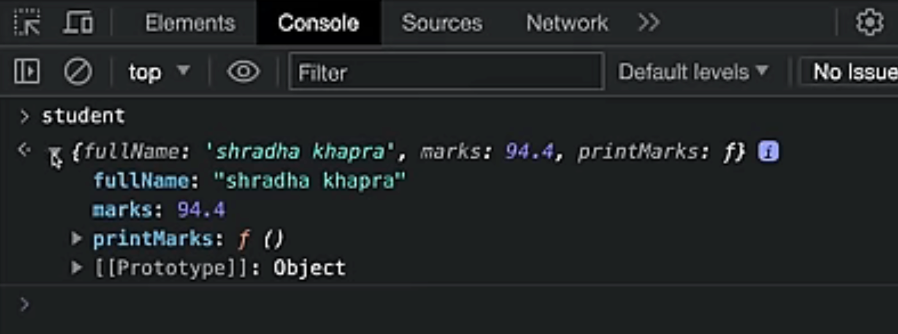

# Classes and Objects

## Prototypes in JS

- A javaScript object is an entity having state and behavior(properties(variables) and method(functions)),
  ### Creating an Object

```javaScript
const student = {
    //? properties
    fullName: "Somel Ahmed",
    marks: 94.4

    //? methods
    printMarks: function() {
        console.log("marks: ", this.marks)
    }
}
```

**If we use this in a object then this means that object.**



- JS objects have a special property called Prototype, **which is also an object and it will also have some properties and methods**.
  
  

  in js, array is also an object, and it will also have prototype as this is an object
  

- we can set prototype using **proto**

### Creating our own prototype

```javaScript
const employee = {
    calTax1() {
        console.log("tax rate is 10%");
    },
    calTax2: function(){
        console.log("tax rate is 10%");
    },
    calTax2: ()=>{
        console.log("tax rate is 10%");
    }
}

const karanArjun = {
    salary: 50000,
}

//? To use calTax(), with karanArjun object, we can use prototype
karanArjun.__proto__ = employee
```


---

```javaScript
const employee = {
    calTax1() {
        console.log("tax rate is 10%");
    },
    calTax2: function(){
        console.log("tax rate is 10%");
    },
    calTax2: ()=>{
        console.log("tax rate is 10%");
    }
}

const karanArjun1 = {
    salary: 50000,
}
const karanArjun2 = {
    salary: 50000,
}
const karanArjun3 = {
    salary: 50000,
}

//? To use calTax(), with karanArjun object, we can use prototype
karanArjun1.__proto__ = employee
karanArjun2.__proto__ = employee
karanArjun3.__proto__ = employee
```

**If object and prototype have same method,**
**object's method will be used**

```javaScript
const employee = {
    calTax1() {
        console.log("tax rate is 10%");
    },
    calTax2: function(){
        console.log("tax rate is 10%");
    },
    calTax2: ()=>{
        console.log("tax rate is 10%");
    }
}

const karanArjun = {
    salary: 50000,
    calTax() {
        console.log("tax rate is 20%");
    }
}

//? To use calTax(), with karanArjun object, we can use prototype
karanArjun.__proto__ = employee
```


**---**

## Classes in JS

- Class is a program-code template for creating objects.
- Those objects will have some state(variables) and some behavior(functions) inside it.

```javaScript
class MyClass() {
    constructor(){...};
    myMethod()(...)
}

let myObj = new MyClass();
```

---

```javaScript
class ToyotaCar() {
    start() {
        console.log("start");
    }

    stop() {
        console.log("stop");
    }
}
```


---

```javaScript
class ToyotaCar() {
    start() {
        console.log("start");
    }

    stop() {
        console.log("stop");
    }

    let fortuner = new ToyotaCar();
}
```


---

```javaScript
class ToyotaCar() {
    start() {
        console.log("start");
    }

    stop() {
        console.log("stop");
    }

    setBrand(brand) {
        this.brandName = brand; //? this means for each individual object
    }

    let fortuner = new ToyotaCar();
    fortuner.setBrand("fortuner");
}
```


**---**

# Constructor

Constructor is a special method.
Constructor method is:

- automatically invoked by new:

```javaScript
let obj = new MyClass();
```

- initializes object

---

```javaScript
class ToyotaCar() {
    constructor() {
        console.log("creating new object");
    }
    start() {
        console.log("start");
    }

    stop() {
        console.log("stop");
    }

    setBrand(brand) {
        this.brandName = brand; //? this means for each individual object
    }

    let fortuner = new ToyotaCar(); //? constructor will be called automatically
    let lexus = new ToyotaCar(); //? constructor will be called automatically
}
```


---

```javaScript
class ToyotaCar() {
    constructor(brand) {
        console.log("creating new object");
        this.brand = brand;
    }
    start() {
        console.log("start");
    }

    stop() {
        console.log("stop");
    }

    setBrand(brand) {
        this.brandName = brand; //? this means for each individual object
    }

    let fortuner = new ToyotaCar("fortuner"); //? constructor will be called automatically
    let lexus = new ToyotaCar("lexus"); //? constructor will be called automatically
}
```


---

```javaScript
class ToyotaCar() {
    constructor(brand, mileage) {
        console.log("creating new object");
        this.brand = brand;
        this.mileage = mileage;
    }
    start() {
        console.log("start");
    }

    stop() {
        console.log("stop");
    }

    setBrand(brand) {
        this.brandName = brand; //? this means for each individual object
    }

    let fortuner = new ToyotaCar("fortuner"); //? constructor will be called automatically
    console.log(fortuner);
    let lexus = new ToyotaCar("lexus"); //? constructor will be called automatically
    console.log(lexus);
}
```


**---**

# Inheritance in JS
Inheritance is passing down properties and methods from parent class to child class.
```javaScript
class Parent {

}

class Child extends Parent {

}
```
- if child and parent have same method, child's method will be used. [Method Overriding]